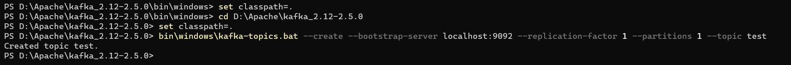

# Spring Boot Kafka POC Getting Started

   ## Set up Kafka locally
>  ### Download Kafka binaries
>   - Create a directory named Apache under C:\FAST and extract contents of the above zip file.
> 
>   ### Setup environment variables
>    - Ensure JAVA_HOME is configured with JDK 1.8+ and the PATH variable is updated. 

   ## Start Zookeeper
>   Kafka uses ZooKeeper to manage the cluster. ZooKeeper is used to coordinate the brokers/cluster topology.
>     
>   Open Command Prompt:    
>   - Run `cd D:\Apache\kafka_2.12-2.5.0` to go to the Kafka scripts directory
>   - Run `set classpath=.` This will add the Kafka java libraries in class path.
>   - Run  `bin\windows\zookeeper-server-start.bat config\zookeeper.properties` to start the Zookeeper.

   ## Start Kafka Server
>   
>   Open a second Command Prompt:
>   
>   - Run `cd D:\Apache\kafka_2.12-2.5.0` to go to the Kafka scripts directory
>   - Run `set classpath=.` This will add the Kafka java libraries in class path.
>   - Run `bin\windows\kafka-server-start.bat config\server.properties` to start the Kafka Server.

   ## Create Kafka Topic
>   A Topic is a category/feed name to which messages are stored and published. Messages are byte arrays that can store any object in any format. All Kafka messages are organized into topics
>
>   Open a third Command Prompt:
>   
>   - Run `cd D:\Apache\kafka_2.12-2.5.0` to go to the Kafka scripts directory
>   - Run `set classpath=.` This will add the Kafka java libraries in class path.
>   - Run `bin\windows\kafka-topics.bat --create --bootstrap-server localhost:9092 --replication-factor 1 --partitions 1 --topic test` which will create 'test' topic.
>
>       
>   We can now see that topic if we run the list topic command:
>   
>   - Run `kafka-topics.bat --list --bootstrap-server localhost:9092`
>       - test

   ## Publish messages to the Kafka Topic

>   Publish messages "hello" and "hi" under topic 'test'
>
>   In third Command Prompt:
>
>   - Run `cd D:\Apache\kafka_2.12-2.5.0` to go to the Kafka scripts directory
>   - Run `set classpath=.` This will add the Kafka java libraries in class path.
>   - Run `kafka-console-producer.bat --broker-list localhost:9092 --topic test`. This will connect to 'test' topic. 
>   - Type 'Hello' and hit Return/Enter. You have published a message to Kafka! 
>   - Type 'Hi' and hit Return/Enter. You have published a message to Kafka! 
>   - Try publishing another message...

   ## Consume messages from the Kafka Topic
   
>   Start consumer to receive message from topic.
> 
>   In fourth Command Prompt: 
>   - Run `cd D:\Apache\kafka_2.12-2.5.0` to go to the Kafka scripts directory
>   - Run `set classpath=.` This will add the Kafka java libraries in class path.
>   - Run `kafka-console-consumer.bat --bootstrap-server localhost:9092 --topic test --from-beginning`

